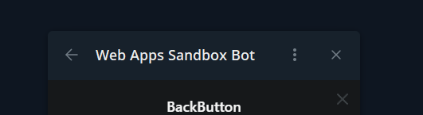

# Back button

Back button is component displayed on the top left of Telegram interface.

The main purpose of this component is to provide native way of going back
in routing history. Of course, it could be used in other ways you need. Button
itself does nothing but sends event which notifies developer about button click.

- [Web App method](../apps-communication/methods.mdx#web_app_setup_back_button)
- [Button clicked event](../apps-communication/events.mdx#back_button_pressed)
