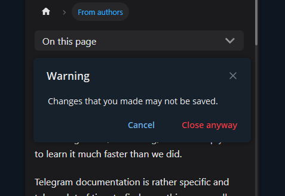

# Closing behavior

It is rather common for Web Apps, when user accidentally closes application
during scrolling it to top. The problem is user could drag application block
too much which will result in application close.

To prevent user from doing this, you could use `closing behaviour`. Web Apps
allows developer to prompt if user really wants to close application. This
functionality could also be used during filling some big forms or something
like that. Just not to lose progress.

- [Web App method](../apps-communication/methods.mdx#web_app_setup_closing_behavior)
