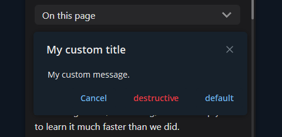

# Popup

Popups are windows, which are opened on the top of Web App. They provide another
level of interaction with user, so developer will not have to implement them by
himself. Nevertheless, popups are not that flexible currently.

Platform allows opening new popups with custom `title`, `message` and `buttons`.
These parameters restrictions:

- `title` - length is from 0 to 64 symbols
- `message` - length is from 1 to 256 symbols
- `buttons` - count is from 1 to 3 buttons

Developer is allowed to set each button's `text` and `type`. Maximum length of
`text` is 64 symbols. `type` determines how button should look like. You can
also use special types, such as `ok`, `close` and `cancel`. Telegram will
use special colors for them and specify localized text according to button
type.

When popup is closed, Telegram will emit connected event with clicked button id.
Telegram will also emit event in case, no buttons were clicked.

- [Web App method](../apps-communication/methods.mdx#web_app_open_popup)
- [Emitted event](../apps-communication/events.mdx#popup_closed)