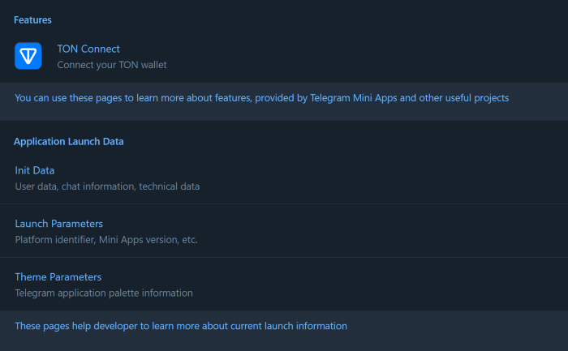

# Telegram Mini Apps React Template

This template demonstrates how developers can implement a single-page application on the Telegram
Mini Apps platform using the following technologies and libraries:

- [React](https://react.dev/)
- [TypeScript](https://www.typescriptlang.org/)
- [TON Connect](https://docs.ton.org/develop/dapps/ton-connect/overview)
- [@telegram-apps SDK](https://docs.telegram-mini-apps.com/packages/telegram-apps-sdk)
- [Telegram UI](https://github.com/Telegram-Mini-Apps/TelegramUI)
- [Vite](https://vitejs.dev/)

> The template was created using [npm](https://www.npmjs.com/). Therefore, it is required to use
> it for this project as well. Using other package managers, you will receive a corresponding error.

## Install Dependencies

If you have just cloned this template, you should install the project dependencies using the
command:

```Bash
npm install
```

## Scripts

This project contains the following scripts:

- `dev`. Runs the application in development mode.
- `build`. Builds the application for production.
- `lint`. Runs [eslint](https://eslint.org/) to ensure the code quality meets the required
  standards.
- `deploy`. Deploys the application to GitHub Pages.

To run a script, use the `npm run` command:

```Bash
npm run {script}
# Example: npm run build
```

## Create Bot and Mini App

Before you start, make sure you have already created a Telegram Bot. Here is
a [comprehensive guide](https://docs.telegram-mini-apps.com/platform/creating-new-app) on how to
do it.

## Run

Although Mini Apps are designed to be opened
within [Telegram applications](https://docs.telegram-mini-apps.com/platform/about#supported-applications),
you can still develop and test them outside of Telegram during the development process.

To run the application in the development mode, use the `dev` script:

```bash
npm run dev
```

After this, you will see a similar message in your terminal:

```bash
VITE v5.2.12  ready in 237 ms

➜  Local:   http://localhost:5173/reactjs-template
➜  Network: http://172.18.16.1:5173/reactjs-template
➜  Network: http://172.19.32.1:5173/reactjs-template
➜  Network: http://192.168.0.171:5173/reactjs-template
➜  press h + enter to show help
```

Here, you can see the `Local` link, available locally, and `Network` links accessible to all
devices in the same network with the current device.

To view the application, you need to open the `Local`
link (`http://localhost:5173/reactjs-template` in this example) in your browser:



It is important to note that some libraries in this template, such as `@telegram-apps/sdk`, are not
intended for use outside of Telegram.

Nevertheless, they appear to function properly. This is because the `src/mockEnv.ts` file, which is
imported in the application's entry point (`src/index.ts`), employs the `mockTelegramEnv` function
to simulate the Telegram environment. This trick convinces the application that it is running in a
Telegram-based environment. Therefore, be cautious not to use this function in production mode
unless you fully understand its implications.

### Run Inside Telegram

Although it is possible to run the application outside of Telegram, it is recommended to develop it
within Telegram for the most accurate representation of its real-world functionality.

To run the application inside Telegram, [@BotFather](https://t.me/botfather) requires an HTTPS link.

This template already provides a solution.

Navigate to the `vite.config.ts` file and uncomment the usage of the `basicSsl` function. This
function utilizes
the [@vitejs/plugin-basic-ssl](https://www.npmjs.com/package/@vitejs/plugin-basic-ssl) plugin, which
enables the creation of an HTTPS link. Note that this plugin generates a self-signed certificate,
which browsers will recognize as unsafe, resulting in a warning when accessing the app.

After uncommenting the function, run the `dev` script again and observe the output in your terminal:

```bash
VITE v5.2.12  ready in 265 ms

➜  Local:   https://localhost:5173/reactjs-template
➜  Network: https://172.18.16.1:5173/reactjs-template
➜  Network: https://172.19.32.1:5173/reactjs-template
➜  Network: https://192.168.0.171:5173/reactjs-template
➜  press h + enter to show help
```

Visiting the `Local` link (`https://localhost:5173/reactjs-template` in this example) in your
browser, you will see the following warning:


This browser warning is normal and can be safely ignored as long as the site is secure. Click
the `Proceed to localhost (unsafe)` button to continue and view the application.

Once the application is displayed correctly, submit one of the `Network` links as the Mini App link
to [@BotFather](https://t.me/botfather). Then, navigate
to [https://web.telegram.org/k/](https://web.telegram.org/k/), find your bot, and launch the
Telegram Mini App. This approach provides the full development experience.

> **Important**
>
> Because we are using self-signed SSL certificates, the Android and iOS Telegram applications will
> not be able to display the application. These operating systems enforce stricter security
> measures, preventing the Mini App from loading. To address this issue, refer
> to [this guide](https://docs.telegram-mini-apps.com/platform/getting-app-link#remote).

## Deploy

This boilerplate uses GitHub Pages as the way to host the application externally. GitHub Pages
provides a CDN which will let your users receive the application rapidly. Alternatively, you could
use such services as [Heroku](https://www.heroku.com/) or [Vercel](https://vercel.com).

### Manual Deployment

This boilerplate uses the [gh-pages](https://www.npmjs.com/package/gh-pages) tool, which allows
deploying your application right from your PC.

#### Configuring

Before running the deployment process, ensure that you have done the following:

1. Replaced the `homepage` value in `package.json`. The GitHub Pages deploy tool uses this value to
   determine the related GitHub project.
2. Replaced the `base` value in `vite.config.ts` and have set it to the name of your GitHub
   repository. Vite will use this value when creating paths to static assets.

For instance, if your GitHub username is `telegram-mini-apps` and the repository name
is `is-awesome`, the value in the `homepage` field should be the following:

```json
{
  "homepage": "https://telegram-mini-apps.github.io/is-awesome"
}
```

And `vite.config.ts` should have this content:

```ts
export default defineConfig({
  base: '/is-awesome/',
  // ...
});
```

You can find more information on configuring the deployment in the `gh-pages`
[docs](https://github.com/tschaub/gh-pages?tab=readme-ov-file#github-pages-project-sites).

#### Before Deploying

Before deploying the application, make sure that you've built it and going to deploy the fresh
static files:

```bash
npm run build
```

Then, run the deployment process, using the `deploy` script:

```Bash
npm run deploy
```

After the deployment completed successfully, visit the page with data according to your
username and repository name. Here is the page link example using the data mentioned above:
https://telegram-mini-apps.github.io/is-awesome

### GitHub Workflow

To simplify the deployment process, this template includes a
pre-configured [GitHub workflow](.github/workflows/github-pages-deploy.yml) that automatically
deploys the project when changes are pushed to the `master` branch.

To enable this workflow, create a new environment (or edit the existing one) in the GitHub
repository settings and name it `github-pages`. Then, add the `master` branch to the list of
deployment branches.

You can find the environment settings using this
URL: `https://github.com/{username}/{repository}/settings/environments`.


In case, you don't want to do it automatically, or you don't use GitHub as the project codebase,
remove the `.github` directory.

### GitHub Web Interface

Alternatively, developers can configure automatic deployment using the GitHub web interface. To do
this, follow the link: `https://github.com/{username}/{repository}/settings/pages`.

## TON Connect

This boilerplate utilizes the [TON Connect](https://docs.ton.org/develop/dapps/ton-connect/overview)
project to demonstrate how developers can integrate functionality related to TON cryptocurrency.

The TON Connect manifest used in this boilerplate is stored in the `public` folder, where all
publicly accessible static files are located. Remember
to [configure](https://docs.ton.org/develop/dapps/ton-connect/manifest) this file according to your
project's information.

## Useful Links

- [Platform documentation](https://docs.telegram-mini-apps.com/)
- [@telegram-apps/sdk-react documentation](https://docs.telegram-mini-apps.com/packages/telegram-apps-sdk-react)
- [Telegram developers community chat](https://t.me/devs)
