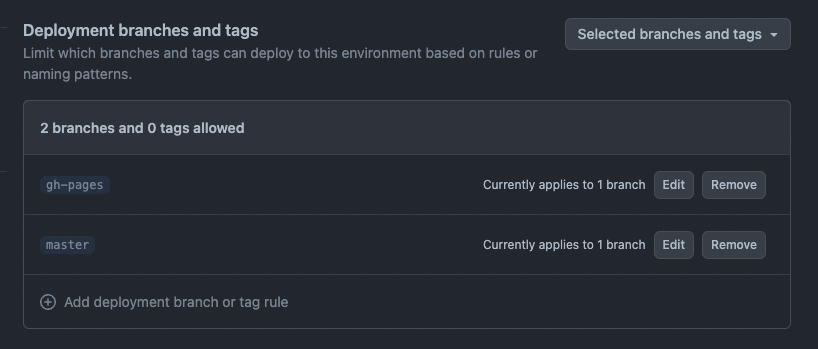

# Telegram Mini Apps React Boilerplate

This boilerplate demonstrates how developers can implement a single-page application on the Telegram
Mini Apps platform using the following technologies:

- [React](https://react.dev/)
- [JavaScript](https://developer.mozilla.org/en-US/docs/Web/JavaScript)
- [TON Connect](https://docs.ton.org/develop/dapps/ton-connect/overview)
- [@tma.js SDK](https://docs.telegram-mini-apps.com/packages/tma-js-sdk)
- [Vite](https://vitejs.dev/)

> This boilerplate was created using [pnpm](https://pnpm.io/). Therefore, it is required to use
> it for this project as well.

## First Start

If you have just cloned this template, you should install the project dependencies using the
command:

```Bash
pnpm i
```

## Scripts

This project contains the following scripts:

- `dev`. Runs the application in development mode.
- `build`. Builds the application for production.
- `lint`. Runs [eslint](https://eslint.org/) to ensure the code quality meets the required
  standards.
- `deploy`. Deploys the application to GitHub Pages.

To run a script, use the `pnpm run` command:

```Bash
pnpm run {script}
# Example: pnpm run build
```

## Running

The first important thing to note here is that the application should always be launched in the
context of Telegram application. You can't just run the application and open it directly in your 
browser via `http://localhost:3000`. Opening application this way will surely lead to errors, as long
as this environment does not provide the required Telegram Mini Apps functionality.

Telegram Mini Apps environment could be any specified
in the [documentation](https://docs.telegram-mini-apps.com/platform/about#supported-applications).

So, before starting the application, make sure you have already created it in the Telegram
system. Here is the [guide](https://docs.telegram-mini-apps.com/platform/creating-new-app) how to do it.

When application is created successfully, run it using the `dev` script and open inside Telegram:

```Bash
pnpm run dev
```

## Deploying

This boilerplate uses GitHub Pages as the way to host the application externally. GitHub Pages provides a CDN
which will let your users receive the application rapidly. Alternatively, you could use such services
as [Heroku](https://www.heroku.com/) or [Vercel](https://vercel.com).

### GitHub Workflow

To simplify the process of deployment, this boilerplate contains already
written [GitHub workflow](.github/workflows/github-pages-deploy.yml) to deploy the project automatically in case, some
content was pushed to the `master` branch.

To let this workflow work properly, it is required create a new environment (or edit the existing one) in the GitHub
repository Settings with the name `github-pages`. Then, add the `master` branch to the list of deployment branches.

Environments settings could be find using this URL: `https://github.com/{username}/{repository}/settings/environments`



In case, you don't want to do it automatically, or you don't use GitHub as the project codebase, just remove the
`.github` directory.

### GitHub Web Interface

Alternatively, developers are able to configure the automatic deployment using GitHub web interface. To use it,
follow the link: `https://github.com/{username}/{repository}/settings/pages`.

### Manual Deployment

This boilerplate uses the [gh-pages](https://www.npmjs.com/package/gh-pages) tool, which allows deploying your 
application right from your PC. 

#### Configuring

Before running the deployment process, ensure that you have done the following:

1. Replaced the `homepage` value in `package.json`. The GitHub Pages deploy tool uses this value to
   determine the related GitHub project.
2. Replaced the `base` value in `vite.config.ts` and have set it to the name of your GitHub
   repository. Vite will use this value when creating paths to static assets.

For instance, if your GitHub username is `telegram-mini-apps` and the repository name
is `is-awesome`, the value in the `homepage` field should be the following:

```json
{
    "homepage": "https://telegram-mini-apps.github.io/is-awesome"
}
```

And `vite.config.ts` should have this content:

```ts
export default defineConfig({
    base: '/is-awesome/',
    // ...
});
```

You can find more information on configuring the deployment in the `gh-pages`
[docs](https://github.com/tschaub/gh-pages?tab=readme-ov-file#github-pages-project-sites).

#### Before Deploying

Before deploying the application, make sure that you've built it and going to deploy the fresh
static files:

```bash
pnpm run build
```

Then, run the deployment process, using the `deploy` script:

```Bash
pnpm run deploy
```

After the deployment completed successfully, visit the page with data according to your
username and repository name. Here is the page link example using the data mentioned above:
https://telegram-mini-apps.github.io/is-awesome

## TON Connect

This boilerplate uses the [TON Connect](https://docs.ton.org/develop/dapps/ton-connect/overview)
project to showcase how developers could integrate TON cryptocurrency-related functionality.

The TON Connect manifest used in this boilerplate is located in the `public` folder along with all
publicly available static files. Don't forget
to [configure](https://docs.ton.org/develop/dapps/ton-connect/manifest) this file according to your
project information.

## Useful Links

- [Platform documentation](https://docs.telegram-mini-apps.com/)
- [@tma.js/sdk-react documentation](https://docs.telegram-mini-apps.com/packages/tma-js-sdk-react)
- [Telegram developers community chat](https://t.me/devs)
